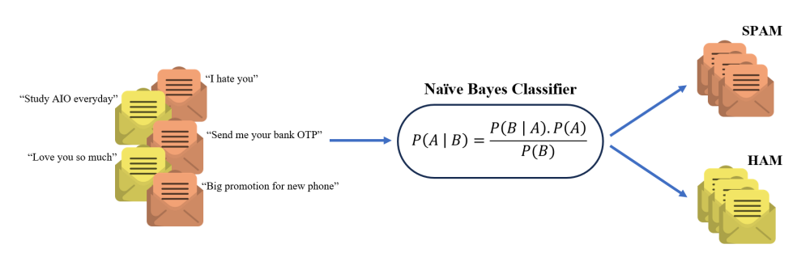
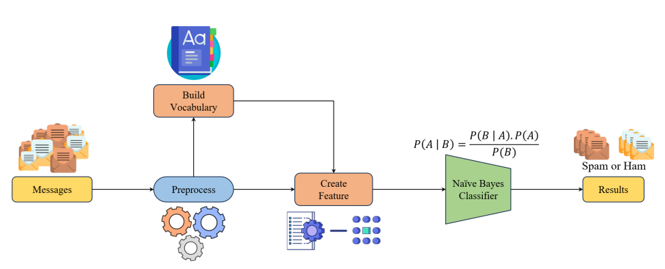
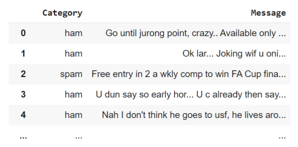
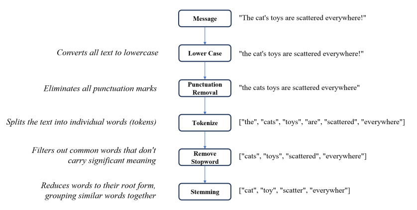
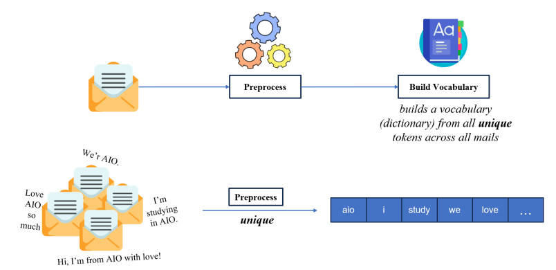
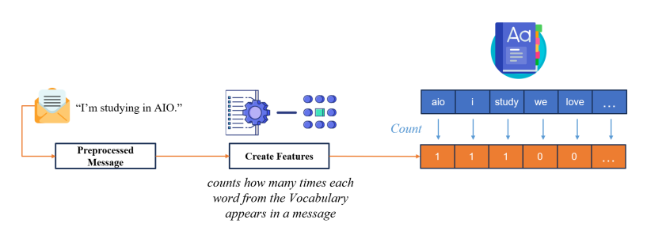
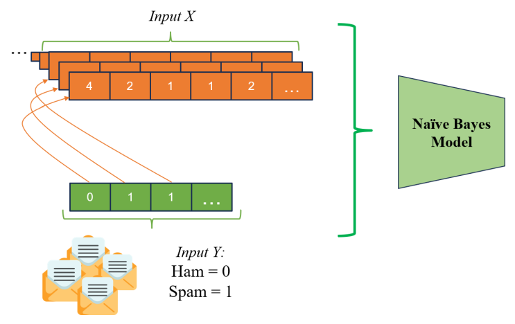
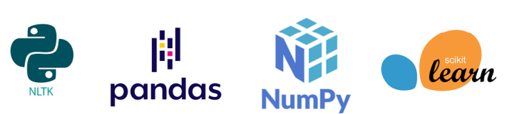

# Text-Classification-Naive-Bayes
## Giới thiệu
Text Classification (Tạm dịch: Phân loại văn bản) là một trong những bài toán phổ biến trong lĩnh vực Machine Learning và Natural Language Processing. Trong đó, nhiệm vụ của chúng ta là xây dựng một chương trình có khả năng phân loại văn bản vào các phân lớp do chúng ta quy định. Các ứng dụng phổ biến liên quan đến loại chương trình này có thể kể đến phát hiện các bình luận tiêu cực trên không gian mạng, các đánh giá tích cực của sản phẩm...

Trong dự án này, chúng ta sẽ xây dựng một chương trình Text Classification liên quan đến việc phân loại một đoạn tin nhắn là tin nhắn spam hay không, sử dụng thuật toán Naive Bayes. Theo đó, Input/Output của chương trình bao gồm:
* Input: Một đoạn tin nhắn (text).
* Output: Có là tin nhắn spam hay không (bool).
Dựa vào các thông tin trên, ta sẽ xây dựng được một luồng xử lý (pipeline) cho bài toán này như sau:

Theo đó, với bộ dữ liệu có nhãn về tin nhắn spam hoặc không spam, chúng ta sẽ đưa qua một số bước tiền xử lý dữ liệu để tách ra các đặc trưng và nhãn tương ứng. Khi đã chuẩn bị bộ dữ liệu cho việc huấn luyện, ta thực hiện xây dựng mô hình Naive Bayes Classifier. Cuối cùng, sử dụng mô hình Naive Bayes đã huấn luyện được, ta có thể dự đoán một tin nhắn bất kì có là spam hay không.

## Dữ liệu training
Bộ bộ dữ liệu sẽ gồm có 2 cột:
1. **Category**: gồm 2 nhãn là Ham và Spam, với ý nghĩa như sau:
* **Ham**: Là những tin nhắn bình thường, không có mục đích quảng cáo hoặc lừa đảo hoặc nói cách khác là  người nhận mong muốn nhận được.
* **Spam**: Là những tin nhắn không mong muốn, thường có mục đích quảng cáo sản phẩm, dịch vụ, hoặc lừa đảo.
2. **Message**: là những nội dung bên trong một Messages.

Nhiệm vụ là dựa vào nội dung Message để phân loại nhị phân với Naive Bayes, để xem xét rằng, liệu với nội dung như thế này thì Message đó là Spam hay Ham.

## Preprocessing (Tiền sử lý dữ liệu)
Nội dung của các Messages (như thư/SMS/email...) vô cùng nhiều và đa dạng các tổ hợp từ hoặc ký tự với nhau.
Trong các trường hợp đặc biệt, chúng có thể là những từ viết tắt (như "’m, ’s, ’re, ...), từ không mang nhiều ý nghĩa (như các dấu câu (.,’/), các biến thể của từ (ví dụ: change, changing, changes, changed, changer, ...) và rất nhiều trường hợp đặc biệt
khác. Vì vậy, bước Tiền xử lý dữ liệu là vô cùng quan trọng với các tác vụ liên quan đến ngôn ngữ. Với bài này, chúng ta sẽ đối phó với chúng với một số hàm đơn giản như hình sau:

## Build Vocabulary
Cần tạo một bộ từ điển (Dictionary), chứa tất các từ hoặc ký tự có xuất hiện trong toàn bộ Messages sau khi được tiền xử lý và không tính trùng lặp.

## Xử lý dữ liệu
Tiếp đến cần tạo ra những đặc trưng đại diện cho thông tin (là các từ) của các Message. Một trong những các đơn giản chính là dựa vào tần suất xuất hiện của từ. Với mỗi Message, vector đại diện sẽ có kích thước bằng với số lượng từ có trong Dictionary.

## Xử lý nhãn
Đối với nhãn của bài toán này, chúng ta sẽ xử lý đơn giản bằng cách chuyển 2 nhãn ham và spam thành các con số 0 và 1 để máy tính có thể hiểu

## Training
### Chia bộ dữ liệu train/val/test:
Khi tiến hành huấn luyệnh một mô hình machine learning, chúng ta sẽ không lấy toàn bộ bộ dữ liệu hiện có để huấn luyện mà sẽ tách ra làm 3 bộ khác nhau. Tại bước này, chúng ta chia bộ dữ liệu thành 3 phần: Train, Validation và Test theo tỉ lệ lần lượt là 7/2/1 (trên tỉ lệ 100% của bộ dữ liệu gốc).

### Huấn luyện mô hình
Truyên 2 input cần thiết vào mô hình Gaussian Naive Bayes và tiến hành huấn luyện bằng các hàm trong thư viện sklearn

### Đánh giá mô hình
Sau khi huấn luyện, chúng ta đến phần đánh giá hiệu suất của mô hình. Bắt đầu với việc cho mô hình đã huấn luyện dự đoán trên tập Validation và Test. Sau đó, sử dụng độ đo Accuracy Score để đánh giá mô hình

## Thực hiện dự đoán
Để sử dụng mô hình cho các Message mới, chúng ta sẽ
phải thực lại các công đoạn Tiền xử lý, tạo đặc trưng cho Message mới này và truyền vào mô hình Naive Bayes.

# Technical stack

* **nltk** (Natural Language Toolkit): Một trong những thư viện xử lý ngôn ngữ tự nhiên phổ biến nhất trong Python
* **pandas**: Cung cấp các cấu trúc dữ liệu hiệu quả và các công cụ để làm việc với dữ liệu
* **numpy**: Cung cấp các đối tượng mảng đa chiều và các hàm toán học để làm việc với các mảng này
* **scikit-learn**: thư viện học máy phổ biến, giúp xây dựng và triển khai các mô hình học máy phức tạp một cách nhanh chóng

# Setup development enviroment
Dự án thực hiện trên Google lab